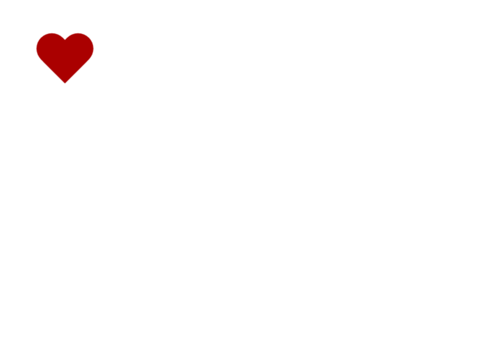

# AnimaTopia

## API Description

It is a powerful tool designed to facilitate automated testing of animations in web applications.
It allows developers and designers to ensure that animations behave as intended, providing a seamless and visually appealing user experience.


## Key Features:

### Declarative API: 
The library offers a declarative API that allows testing web animations, CSS transitions, and SVG based animations.
Developers can define CSS transitions using [web animation object interface](https://developer.mozilla.org/en-US/docs/Web/API/Web_Animations_API/Using_the_Web_Animations_API) for testing purposes.
This approach simplifies the testing process and aligns with existing animation development workflows.

The core functionality is currently being worked on to be imported to popular game engines such as **Unity**.

### Visual Regression Testing: 
The library employs visual regression testing techniques to compare frames and detect any visual differences between animation states.
By capturing and analyzing frames at various points during an animation, developers can ensure visual accuracy and identify potential issues, such as unexpected artifacts or glitches.

### Flexible and Extensible: 
The library is designed with flexibility in mind, allowing developers to customize and extend its functionality to suit specific testing requirements.
It provides hooks and callbacks for incorporating additional logic, handling animation events, and integrating with other testing frameworks or tools.


## Benefits:
- It saves tons of time to visually test animations on the Web and in game engines (TO-DO).
- A great tool that detects changes and anomalies in animations.
- It captures frame by frame screenshots of the animation based on a frame rate and frame delay values provided as inputs.

### Improved Animation Quality: 
By integrating the Animation Regression Testing Library into the development process, developers can catch animation-related issues early, resulting in higher-quality animations that enhance the overall user experience.

### Time and Effort Savings: 
Automated testing eliminates the need for manual inspection of animations, reducing the time and effort required for regression testing. 
Developers can focus on creating and fine-tuning animations, knowing that they will be automatically validated.

If your core product relies on smooth web transitions, then this library should be used in order to garantee that each frame is as elegant as possible.

#### Frame Capture: 
The library captures frames at various points during the animation, utilizing platform-specific mechanisms such as requestAnimationFrame or native APIs. The captured frames are stored for subsequent comparison and analysis.

#### Frame Comparison: 
Visual regression testing is performed by comparing the captured frames with reference frames or baseline images. Various image comparison algorithms are employed to identify visual differences, including pixel-level comparisons, color thresholding, and structural similarity index measurements.
Initially, it saves all the frames of the animation as baseline images which will be compared against new actual screenshots in order to check if there is a mismatch in each and every frame.


## What is still missing?
 1. Support for game engines
 2. Support for WebGl


## Parameters of `matchAnimationFrames`

| Prop Name              |     Type                    | Default      |
| ---------------------- | :-------------------------: | -----------: |
| baselineFolder         |     String                  |              |
| actualFolder           |     String                  |              |
| diffFolder             |     String                  |              |
| url                    |     String                  |              |
| selector               |     String                  |              |
| frameRate              |     Number                  | 60           |
| frameDelay             |     Number                  | 100          |
| pageScreenshotDelay    |     Number                  | 100          |
| maxCaptureDuration     |     Number                  | 500          |
| isSvg                  |     Boolean                 |              |
| animationName          |     String                  |              |
| cssTransitionData      |     [Web Animation Interface](https://developer.mozilla.org/en-US/docs/Web/API/Web_Animations_API/Using_the_Web_Animations_API) |              |
| frameImagePrefix       |     String                  |              |
| triggerInfo            |     Object                  |              |


## Usage

### Web Animation that runs on page load

```javaSccript
const { matchAnimationFrames } = require('animatopia')
await matchAnimationFrames({
   url: 'http://localhost:3000/',
   selector: '.wrapper',
   frameRate: 60,
   maxCaptureDuration: 3000,
   frameDelay: 20,
   pageScreenshotDelay: 100,
   animationName: 'pulse'
})
```

#### <svg> Animation that runs on page load

```javaSccript
const { matchAnimationFrames } = require('animatopia')
await matchAnimationFrames({
   url: 'http://localhost:3000/',
   selector: '.wrapper',
   frameRate: 60,
   maxCaptureDuration: 3000,
   frameDelay: 20,
   pageScreenshotDelay: 100,
   animationName: 'pulse',
   isSvg: true
})
```

#### Animation that is triggered on user interaction

```javaSccript
const { matchAnimationFrames } = require('animatopia')
await matchAnimationFrames({
   url: 'http://localhost:3000/',
   selector: '.wrapper',
   frameRate: 60,
   maxCaptureDuration: 3000,
   frameDelay: 20,
   pageScreenshotDelay: 100,
   animationName: 'pulse',
   triggerInfo: {
      triggerAction: 'click',
      triggerSelector: '.wrapper'
   }
})
```

#### CSS transition that is transformed into animation

```javaSccript
const { matchAnimationFrames } = require('animatopia')
await matchAnimationFrames({
   url: 'http://localhost:3000/',
   selector: '.wrapper',
   frameRate: 60,
   maxCaptureDuration: 3000,
   frameDelay: 20,
   pageScreenshotDelay: 100,
   cssTransitionData: {
      keyframes: [{offset: 0, transform: 'scale(1)'}, {offset: 1, transform: 'scale(2)'}],
      duration: 1000,
      easing: 'linear',
      iterations: 1,
      fill: '',
      delay: 0
   },
   triggerInfo: {
      triggerAction: 'hover',
      triggerSelector: '.wrapper'
   }
})
```

## Sample Frames





